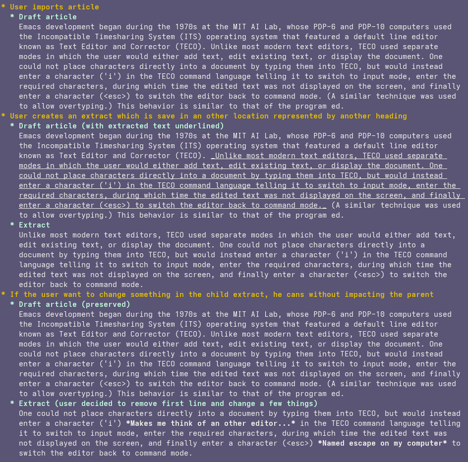
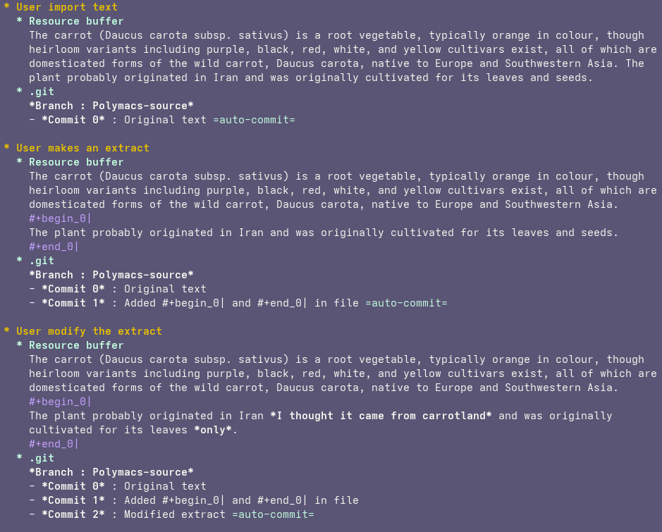
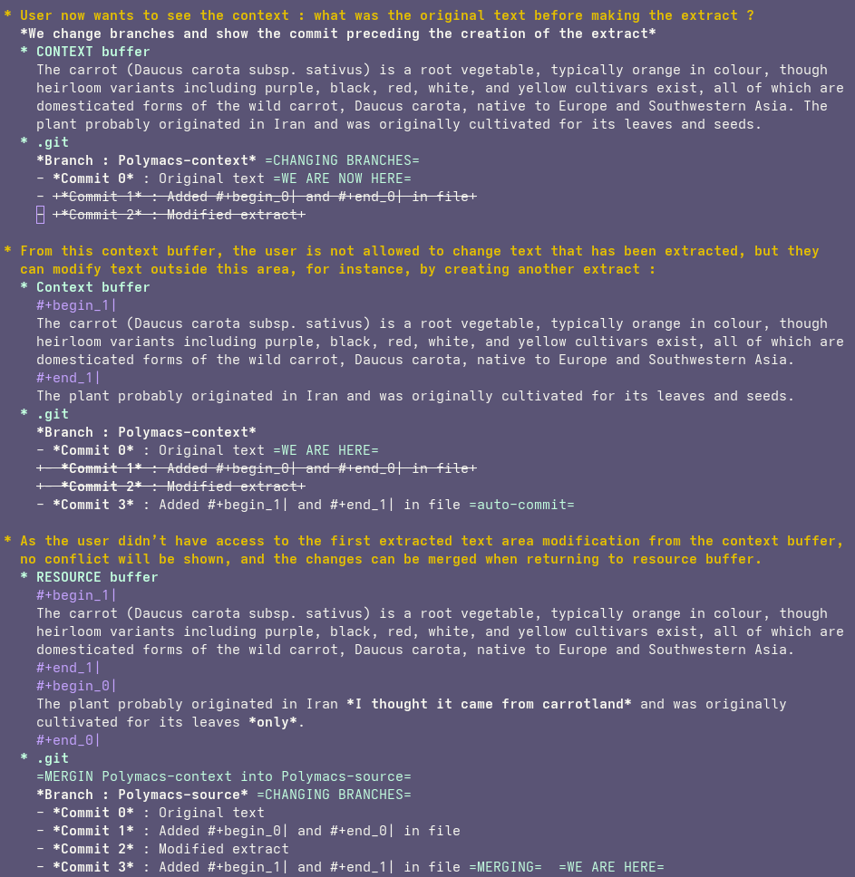

# POC: Using Git to Get Element Context

Preservation of context is an essential feature to implement in incremental reading. It helps to get a big picture of the subject, remember where the current element comes from, and see elements that could otherwise be deleted in descending nodes.

One approach to this could be saving multiple instances of the same text area, with the necessary modifications related to the element's goal. 
Example (text from [Wikipedia](https://en.wikipedia.org/wiki/Emacs)):

This could work, using something like Org files to save this data, or even a database to store all of the text. However, saving multiple instances of the same text is quite heavy, not very elegant, and cumbersome.

The approach that seems more viable would be to use Git as a version control system, allowing us to replay a snapshot of a file to rigorously track the modifications and thus the context, ensuring that data storage is optimized. `git show <commit>:<file>` will be our best friend.

This creates a few obstacles:
1. Commits must be made systematically for every action performed on the text (modification, extraction, moving, etc.). Emacs handles this well with hooks if the file is modified. For other cases, there are two solutions: protect external modifications of Polymacs resource files by making them read-only or include a tool to clean changes based on file differences with existing commits. The first option looks much easier.
2. The user will be unauthorized to modify a portion of the context that has already been extracted into a sub-extract (see example below).
3. It requires a way to save commit hashes associated with specific extract creation/modification to quickly return to a past snapshot. SQLite can handle this.
4. There is a limitation in cascading context modifications if children have been modified: if a user created and modified an extract and now wants to change something from the context element, this can’t easily propagate to children, as it will result in a conflict.

Example showing the general principle of this approach:

 

For more complex cases, where a user wants to show the context of an element and this context element has many extracted children, it is still possible to do so efficiently, maybe by getting the commit content if needed and displaying it directly in the context buffer. A basic implementation would significantly help visualize more complex cases and assess the viability of this solution for harder cases.

Git is fast and optimized to work on large commit collections. Performing a lot of atomic commits will be invisible to the user, while still providing a robust way for the user to visualize context.

On paper, it could be a great solution, at least enough to give it a try!
