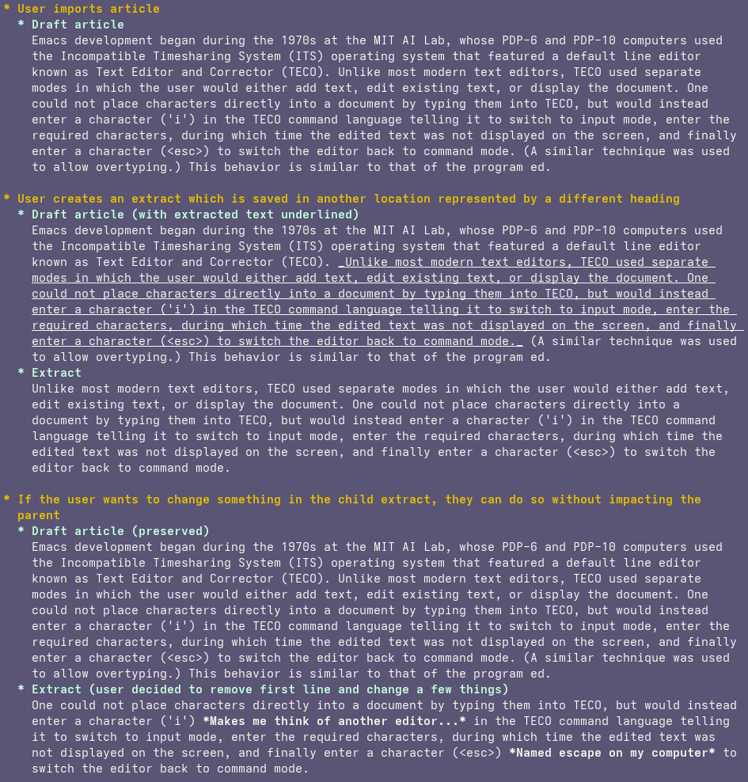
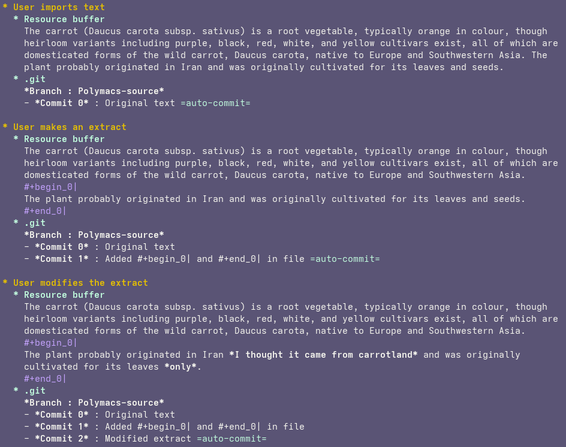

# POC: Using Git to build contexts and extracts

Preservation of context is an essential feature to implement in incremental reading. It helps to get a big picture of the subject, remember where the current element comes from, and see elements that could otherwise be lost in descending nodes. We need to find a way to save every extract created by the user while rigorously preserving the context from which each extract originates, and thus, in a nested manner.

The approaches and examples described here are not meant to be implemented exactly as presented but rather to illustrate ideas.

# Initial approach
One approach to this could be saving multiple instances of the same text area, with the necessary modifications related to the element's goal. 
Example ([source-text](https://en.wikipedia.org/wiki/Emacs)):

This could work, using Org files to save this data. However, duplicating the same text across multiple instances is quite heavy, not very elegant, and cumbersome.

# Selected approach
The approach that seems more viable would be to use Git as a version control system, allowing us to replay a snapshot of a file to rigorously track the modifications and thus the context, ensuring that data storage is optimized. `git show <commit>:<file>` will become an essential tool..

This approach introduces a few challenges:
1. Commits must be made systematically for every action performed on the text (modification, extraction, moving, etc.). Emacs handles this well with hooks if the file is modified. For other cases, there are two solutions: protect external modifications of Polymacs resource files by making them read-only or include a tool to clean changes based on file differences with existing commits. The first option looks much easier.
2. It requires a way to save commit hashes associated with specific extract creation/modification to quickly return to a past snapshot. Plain-text/org properties can handle this.
3. There is a limitation in cascading context modifications if children have been modified: if a user created and modified an extract and now wants to change something from the context element, this can’t easily propagate to children, as it will result in conflicts. (the first approach would have the same problem, though)

Example showing the general principle of this approach (The extracted section is here shown with #+begin_x| and #+end_x|) ([source-text](https://en.wikipedia.org/wiki/Carrot)):

 

## Detailed example and viable solution

In fact, with this approach, it is still possible to modify the context from which an extract was made, without affecting the extract itself. In this example, we show that by using two branches, it is possible to build the buffer exactly as we want.

- The Polymacs-source branch is used as the source of truth: every modification, extraction, or deletion will be saved there.
- The Polymacs-build branch is used to construct what will be shown to the user, by selecting the appropriate commits gathered from the Polymacs-source branch.

It doesn't matter whether the file at the tip of Polymacs-source (i.e. HEAD) appears coherent or not. As long as the buffer history is properly maintained by the package, it will always be possible to rebuild a consistent version of the buffer from the Polymacs-build branch. ~~,saving the plain-text Org file in whatever state we choose. So even if we examine the file outside of Emacs (with cat, for example), it can still appear clean and coherent if we decided to build it that way before ending the learning session (which will typically be the case!).~~ (No, for this last point, the original file is actually where all the data will be stored. But it’s not a big deal if it can’t be accessed regularly outside of Emacs, as long as Polymacs can export a clean build of the file when needed. Or maybe this last point is possible if we can keep all of the data inside Git (to be explored...).)

Auto-commits will be triggered for every action that needs to be recorded in a Polymacs buffer. When the user saves the buffer, we will also check whether any modifications have been made and apply commits if needed.

We've kept this example on a simple structure (context - extract), but by following the same rules, this approach can scale to as many nested levels as desired.

Example ([source-text](https://en.wikipedia.org/wiki/Kindness)):

\~extract\~ 
\<\<modifications\>\> 
=infos= 
+ignored+ 
/comment/ 
... : Collapsing commit history for readability 

 
 
 
 
 

In fact, it's even simpler in reality: if we want to show a specific extract, we just need to select the last commit made on that portion of text and parse the extract delimiters (see [Build process](#build-process)).

To simplify this build process, commit hashes will be saved alongside the learning data in a dedicated tree (one tree per file), represented by an Org heading tree with each extract acting as a node in that tree. In this example, under the branch referring to extract 2, for instance, we would store "Commit 4" and "Commit 5" hashes. Whenever we want to visualize this extract, we simply rebuild the buffer by choosing from those commits, depending on which version of the extract we want to see at a specific point in time.

## Does git really optimize space with this approach ?

The question of commit alternation is an important point. The commit history on the polymacs-source branch will be linear, and two consecutive commits can have drastically different content, even though each commit individually could have very similar instances already present in the repository. This is because a user can work on one extract, modify it (which triggers an automatic commit), then switch to a completely different extract and modify that as well (also triggering an automatic commit). Looking at the commit history, the diffs between successive commits may seem significant, but it's an illusion, Git just reconstructs a nice human-readable view, while under the hood, it optimizes all of that.

We can illustrate that :

Suppose you have a file that you modify drastically between each commit, alternating among 3 states that reoccur regularly but with slight modifications each time:

- Commit 1: state 1
- Commit 2: state 2 (very different from 1)
- Commit 3: state 3 (very different from 1 and 2)
- Commit 4: state 1.1 (close to state 1)
- Commit 5: state 2.1 (close to state 2)

Even though there are large differences when looking at successive commits, Git optimizes storage with its delta compression algorithm by reusing data from older commits. The file is not fully saved at every commit, nor are the entire changed portions saved each time. Though it's worth noting that Git doesn't optimize storage after each commit, but rather during operations like git gc or git repack, it does perform these operations automatically from time to time.

Git is fast and optimized for large collections of commits, especially when changes are generally small, as will usually be the case here. Making a large number of atomic commits will be seamless to the user, while providing a robust way to visualize context, minimize data duplication, and maintain a clean, readable history.

## Build process

When presenting the desired extract to the user, the file is constructed on the polymacs-build branch, using selected commits from polymacs-source. If we want to show the latest state of, let's say, a specific context, we need to cherry-pick the last commit made on that context from the source to the build branch. This may result in conflicts, but as long as we automatically select the most recently changed commits (using the appropriate function), they can be resolved.

When displaying the extract, if the user wants to modify it, they will do so, and a new commit will be added to polymacs-build, which will then be cherry-picked onto polymacs-source. In case of a conflict, the same process applies: we keep the last commit (the cherry-picked one).

When we want to display an extract and cannot org-narrow the content because it is not a full heading, we need to extract from the last commit relevant to the extract and delimit the chosen area using an arbitrary polymacs syntax and ID reference.

## 2 problems faced with this approach 
Analysing and discuting about this approach, 2 problems are indeed relevant :

### No delta compression intra-file
Git does use delta compression to save similar or resembling text extracts with the least space possible, by storing only the differences. However, this process is applied only between different files or different versions of the same file across commits, not inside a single file. This means that if a pattern repeats multiple times within one file (as is the case when creating extracts inside a single file), Git won't detect these similar patterns nor optimize them.

However, this problem can be efficiently circumvented: by creating one file per extract (the name of the file will be the ID of the extract), committing it, and then deleting it (to avoid cluttering the Polymacs folder), the extract remains accessible through Git history, and compression will be performed among similar extracts. If we then wan't to modify the extract, we have to recreate a file with the same name, past the saved content and then commit text with changes and deleting it in next commit, ensuering a continuity for each extracts across git repository. Of course, this entire process will be done under the hood, hidden from the user.

### High accumulation of commits
Following the method described above, a single revision session can easily generate hundreds of commits. Over 50 years, with about 500 commits per day, that would add up to over 9 million commits, which is definitely way too much. But there’s no need to keep every change spread across so many commits when they can be grouped into one. During a session, temporary commits are made for each action, and at the end, they’re combined into a single session commit to avoid that overload. This approach still requires some careful handling when modifying extracts, to avoid conflicts and make sure all the necessary information is kept to properly rebuild contexts and extracts.
